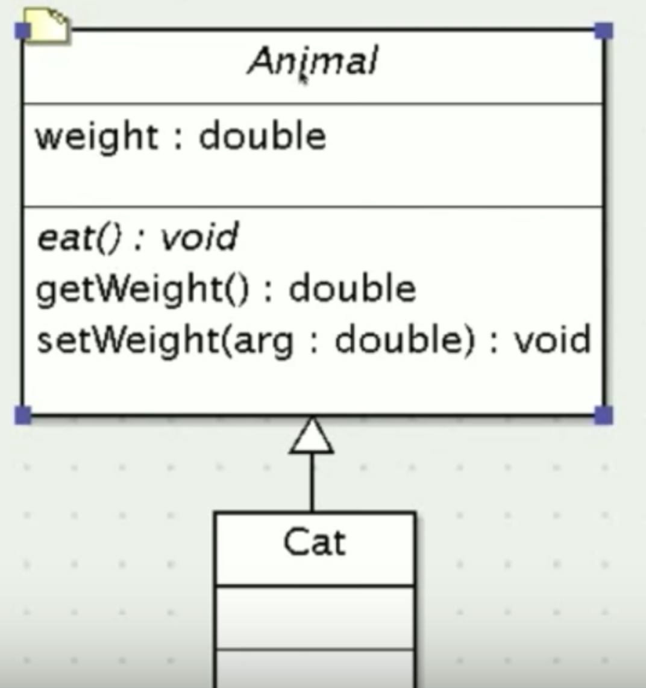
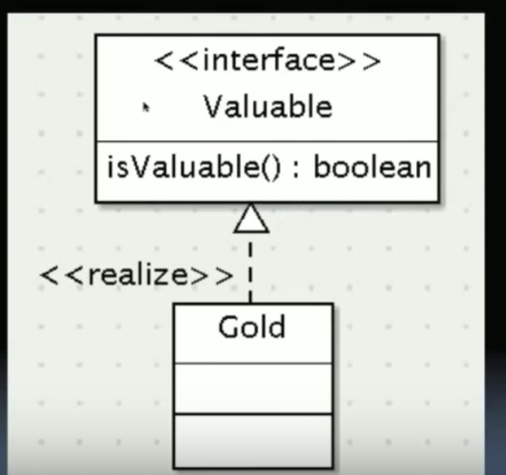

# abstract classes vs interfaces

## abstract class
a class that represents a generlization and provides functionality but is only intended to be extended and not instantiated

**extends**

- may contain instance or static variables (no different than regular classes)
- my contain instance or static methods (no different than regular classes)
- never meant to be instantiated. may contain a constructor but it can not be called directly. You will never call 'new' on it. The subclass needs to call the constructor for you
- may contain abstract methods - methods that have no implementation (the part between curly brackets) they are implemented in the subclass
- any class that contains an abstract method is itself an abstract class regardless of how it is defined

In the example above, Cat will need to implement this method
Animal is generic, but cat extends it. We can't visualize an animal but we can visuals a concrete example of an animal (e.g. cat)

## interface

a **completely** abstract class that defines a protocol for object interactions

**implements**

- may contain only static final variables 
  - there is no 'instance' of an interface
- may contain only abstract methods
- can not contain a constructor as interfaces can not be instantiated
- interfaces can extend other interfaces
- a class can implement any number of interfaces
- a class that implements an interface has an is-a relationship with that data type

Gold is 'realizing' this interface by agreeing to conform to the contract set by Valuable

## Take-aways
- abstract classes and interfaces allow us to define a set of standard protocols for programmers to implement in their code.
- standardization is good. compiler enforced standardization is better. 'compiler enforced' meaning that the compiler is going to check that people have implemented your abstract classes or interfaces correctly
- interfaces allow objects to be polymorphic beyond the constraints of single inheritance
- remember that interfaces require a lot of coding to be implemented